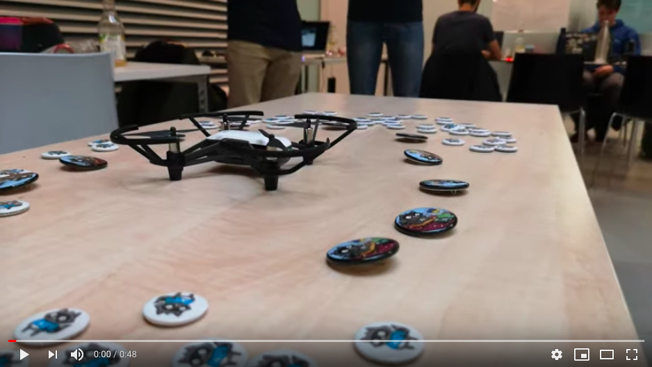
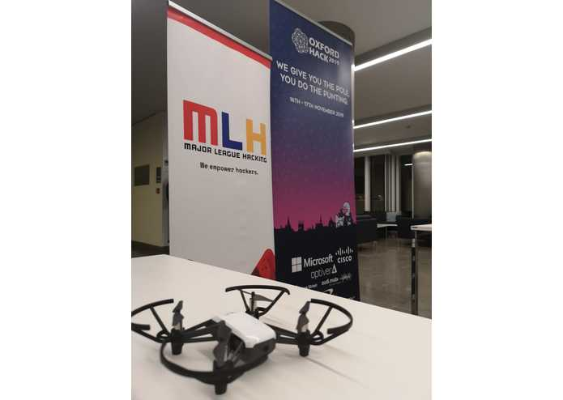
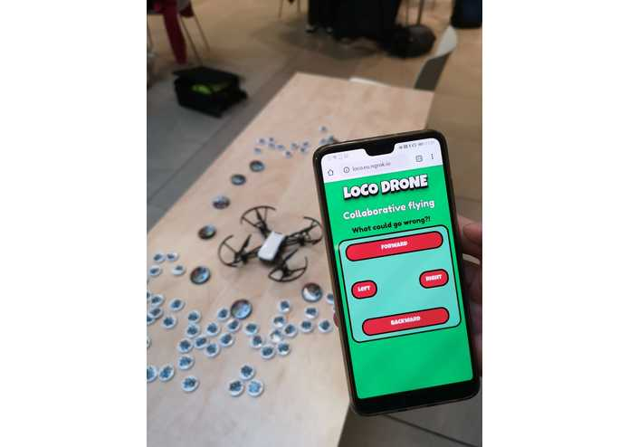

# LocoDrone: Collaborative flying! by Insighters at Oxford Hack 2019

One drone & many people controlling it from our website, what could go wrong?

We were awarded the following prizes at Oxford Hack 2019:

* Hackers' Choice
* Most Inventive Hack
* Best UiPath Automation Hack

[Devpost](https://devpost.com/software/loco-drone)

## Video & Figures

## Technologies

* Python 2.7
* [Tello SDK](https://github.com/dji-sdk/Tello-Python)
* [Flask](http://flask.pocoo.org/)
* [Docker](https://www.docker.com/)

## Motivation

Imagine 300 people controlling a drone, what could go wrong?

## What it does

The users control the drone from a website, while we stream the drone FPV on the big screen!

## How we built it

Using open source stuff like Docker containers, Python, Flask & OpenCV. The Tello SDK allow us to control the drone, while the Flask frontend provides the UI. We got the domain locodrone.online, which redirects to the Ngrok tunnel that points to our localhost where the webpage is served.

## Challenges we ran into

1. Connecting to the drone and to the internet at the same time. Since we need to use the laptop's wifi (for the drone) + Ethernet (to publish the web) we created a Ethernet bridge from one laptop to another.
2. Streaming the video, the Tello SDK documentation is pretty short so we checked the low level source code to understand how to use it.
3. Connecting multiple clients to Flask in a reliable way

## Accomplishments that we are proud of

Make the pipeline work. It is actually very complex

## What we learned

Tello SDK, Docker and Flask

## What's next for LocoDrone!

Fly on a big room controlled by 300 people!
